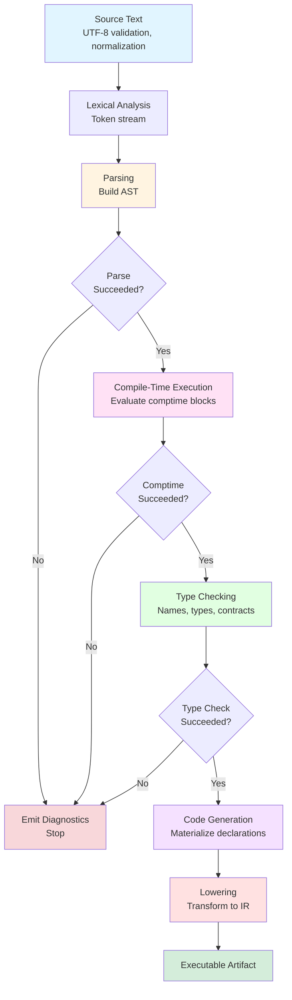

# Cursive Language Specification

## Chapter 2: Lexical Structure and Translation [lex]

**Forward references**: Chapter 3 [basic], Chapter 4 [module], Chapter 6 [names], Chapter 7 [types], Chapter 16 [comptime], Annex A [grammar]

---

### 2.1 Source Text and Encoding [lex.source]

#### 2.1.1 Overview [lex.source.overview]

Cursive source files must be encoded as UTF-8. The compiler validates encoding, normalizes line endings, and performs lexical preprocessing before tokenization. This section specifies the requirements for well-formed source text at the character level.

A _source file_ is the decoded Unicode scalar stream after UTF-8 validation and line-ending normalization. A _compilation unit_ is the textual content of a single source file after this preprocessing step. Chapter 4 [module] derives module paths from compilation units based on file system layout.

#### 2.1.2 Character Encoding [lex.source.encoding]

Implementations must accept only byte streams that decode to legal UTF-8 sequences. Invalid byte sequences are ill-formed and must elicit diagnostic E02-001.

The byte order mark (BOM), U+FEFF, is optional. If present, it must appear as the first byte sequence in the file. The compiler must strip the BOM before any further analysis. Any occurrence of U+FEFF after the first decoded scalar value must trigger diagnostic E02-003.

**Example 2.1.2.1** (Valid UTF-8 with BOM):

```cursive
// Module with BOM (invisible U+FEFF at start)
let greeting = "Hello, world"
let delta = "Δ"  // Non-ASCII scalar value
```

The compiler accepts this file, strips the BOM, and processes the remaining UTF-8 content normally.

#### 2.1.3 Shebang Lines [lex.source.shebang]

The compiler must recognize and ignore Unix shebang lines at the beginning of a source file. A shebang line begins with the two-character sequence `#!` and extends to the first line terminator or end of file.

If present, the shebang must appear before any BOM. The precedence order is:

1. Optional shebang line (first line of file)
2. Optional BOM (immediately after shebang, if present, or at file start)
3. Remaining source content

The shebang line is discarded during preprocessing and does not participate in tokenization. This feature enables Cursive source files to be executed directly as scripts on Unix-like systems.

**Example 2.1.3.1** (Shebang with executable script):

```cursive
#!/usr/bin/env cursive
// This file can be executed directly on Unix systems

procedure main() {
    println("Hello from a Cursive script!")
}
```

The compiler ignores the shebang line and processes the file normally, enabling the same source file to serve as both a compilation unit and an executable script.

#### 2.1.4 Line Ending Normalization [lex.source.lines]

Implementations must recognize LF (U+000A), CR (U+000D), and CRLF (U+000D U+000A) sequences as line terminators and normalize each to a single LF code point before tokenization. Mixed line endings within a single file are permitted; the normalization process preserves the number of logical lines.

After normalization, LF characters become significant tokens that participate in automatic statement termination (§2.5 [lex.terminators]). The normalization is transparent to the programmer but ensures consistent behavior across platforms.

Implementations may issue warning W02-001 when a file contains mixed line ending styles (e.g., some lines with LF and others with CRLF), but this warning does not prevent compilation.

**Example 2.1.4.1** (Mixed line endings):

```cursive
let x = 1   // Line ending: CRLF
let y = 2   // Line ending: LF
```

The compiler normalizes both line endings to LF and may issue W02-001 to alert the programmer about inconsistent formatting.

#### 2.1.5 Prohibited Code Points [lex.source.prohibited]

Outside string and character literals, the compiler permits only the following control characters from Unicode category Cc:

- Horizontal tab (U+0009)
- Line feed (U+000A)
- Carriage return (U+000D)
- Form feed (U+000C)

All other control characters are prohibited in source text outside of literals and must trigger diagnostic E02-004.

The null character (U+0000) is forbidden everywhere, including within string and character literals, and must trigger diagnostic E02-004.

Implementations may issue warning W02-002 when source files contain form feed characters (U+000C), as this character is rarely used in modern source code and may indicate encoding issues or unintended content.

#### 2.1.6 File Size Requirements [lex.source.size]

Implementations must support source files of at least 1 MiB (1,048,576 bytes). Implementations may impose larger limits but must document their maximum supported file size.

Files exceeding the implementation-defined limit must trigger diagnostic E02-002. Implementations should report the file size and the implementation's limit in the diagnostic message.

Implementations may issue warning W02-003 for source files that exceed a reasonable size threshold (e.g., 100 KiB) to alert programmers to potential organization issues, even if the file is within the supported limit.

#### 2.1.7 Examples [lex.source.examples]

**Example 2.1.7.1** (Minimal valid source):

```cursive
// Empty module with only a comment
```

This compilation unit contains no declarations but is well-formed. It defines a module with no exports.

**Example 2.1.7.2** (Invalid: embedded BOM):

```cursive
let x = 1
let y = 2  // error[E02-003]: BOM after first line
```

The second line embeds U+FEFF after decoding, violating the constraint that BOMs may only appear at the file's beginning.

**Example 2.1.7.3** (Invalid: null character):

```cursive
let name = "Alice\0Bob"  // error[E02-004]: U+0000 forbidden everywhere
```

The string literal contains U+0000, which is prohibited even within literals.

#### 2.1.8 Conformance [lex.source.conformance]

Implementations must document:

- The Unicode version used for validation and normalization.
- The maximum supported source file size.
- The behavior when encountering invalid UTF-8 sequences (diagnostic E02-001).

Implementations must emit diagnostics E02-001 through E02-004 at the location of the offending byte sequence or code point. Diagnostic messages should be informative; suggestions in diagnostic text are informative, but the failure remains normative.

---

### 2.2 Unicode Normalization [lex.unicode]

#### 2.2.1 Overview [lex.unicode.overview]

Cursive recommends Unicode Normalization Form C (NFC) for source text processing. When implementations perform normalization, it ensures that logically equivalent Unicode sequences are treated as identical, preventing subtle bugs caused by different representations of the same characters.

This section specifies normalization recommendations and their impact on identifier comparison and source text processing.

#### 2.2.2 Normalization Requirements [lex.unicode.norm]

Implementations must accept source files in any Unicode normalization form (NFC, NFD, NFKC, NFKD). Implementations should normalize all text to NFC before tokenization and identifier comparison to ensure consistent behavior across platforms and editors.

The normalization process, when performed, should occur after UTF-8 validation and BOM removal but before lexical analysis. Normalization should preserve source line boundaries and byte offsets used for diagnostic reporting by tracking the original source positions throughout the pipeline.

**Example 2.2.2.1** (Normalization equivalence):

```cursive
// These two declarations are equivalent after NFC normalization:
let café = 1      // 'é' as single precomposed character (U+00E9)
let café = 2      // error[E02-400]: redeclaration
                  // 'é' as 'e' (U+0065) + combining acute (U+0301)
```

Both identifiers normalize to the same NFC form, so the second declaration is rejected as a redeclaration.

#### 2.2.3 Identifier Comparison [lex.unicode.comparison]

Identifier comparison should occur after NFC normalization when normalization is performed. Two identifiers are considered identical if and only if their NFC-normalized forms are byte-for-byte equal.

This normalization applies to all identifiers in the source, including:

- Variable and constant names (§5.2 [decl.variable])
- Type names (§5.5 [decl.type])
- Procedure names (§5.4 [decl.procedure])
- Module path components (§4.2 [module.syntax])
- Label names (§6.4 [names.lookup])

The normalization ensures that visually identical identifiers are treated as identical by the compiler, regardless of the underlying Unicode representation.

**Example 2.2.3.1** (Case sensitivity with normalization):

```cursive
let Naïve = 1     // NFC: Naïve
let naïve = 2     // NFC: naïve (distinct from Naïve)
let Naïve = 3     // error[E02-400]: redeclaration (same NFC form as first)
```

Cursive is case-sensitive (§6.4 [names.lookup]), so `Naïve` and `naïve` are distinct. However, different Unicode representations of `Naïve` are treated as identical after NFC normalization.

#### 2.2.4 Diagnostic Guidance [lex.unicode.diagnostics]

Implementations may issue warning W02-004 when source files contain identifiers that differ only in normalization form from other identifiers in scope. This warning helps programmers detect potential confusion caused by visually identical but technically distinct Unicode sequences.

Implementations may also issue warning W02-005 when source files contain characters that are visually ambiguous (e.g., Cyrillic 'а' U+0430 vs. Latin 'a' U+0061), as these can lead to subtle bugs where identifiers appear identical to human readers but are treated as distinct by the compiler.

#### 2.2.5 Conformance [lex.unicode.conformance]

Implementations should apply NFC normalization to all source text before identifier comparison. Implementations must document:
- Whether they perform Unicode normalization
- If normalization is performed, which normalization form is used (NFC recommended)
- The Unicode version used for normalization algorithms

When normalization is performed, implementations must ensure that it does not alter the reported locations of diagnostics. Source positions in diagnostic messages must refer to the original, pre-normalization source text to enable tools to correlate errors with editor positions accurately.

---

### 2.3 Translation Phases [lex.phases]

#### 2.3.1 Overview [lex.phases.overview]

Cursive compilation proceeds through a deterministic pipeline of translation phases that convert validated UTF-8 source (§2.1 [lex.source]) into executable artifacts. The phases expose explicit intermediate products so that diagnostics, tooling, and contracts can observe well-defined boundaries.

A program is _well-formed_ when every compilation unit completes each translation phase without producing a fatal diagnostic (error). Warnings do not prevent compilation but should be addressed to improve code quality and maintainability.

Cursive deliberately omits textual preprocessing. The pipeline begins immediately with lexical analysis (§2.4 [lex.tokens]), ensuring that all transformations are performed with full syntactic and semantic context rather than token substitution. There are no macro facilities, no `#include` directives, and no preprocessor conditional compilation.

#### 2.3.2 Phase Pipeline [lex.phases.pipeline]

The pipeline follows a **two-phase compilation model**: the parsing phase records the complete set of declarations and their structural metadata without enforcing semantic requirements, and the semantic phases (compile-time execution, type checking, code generation, and lowering) run only after parsing succeeds. This model guarantees that declarations may appear in any order within a compilation unit—forward references are resolved during the semantic phases rather than requiring separate stub declarations.

The translation phases execute in the following order:

1. **Parsing**: Constructs abstract syntax tree (AST) from token stream
2. **Compile-Time Execution**: Evaluates `comptime` blocks in dependency order
3. **Type Checking**: Resolves names, validates types, enforces contracts
4. **Code Generation**: Materializes declarations requested by comptime execution
5. **Lowering**: Transforms AST into intermediate representation (IR)



Implementations may internally refactor work, but they must present the externally observable phase boundaries in the order specified. Type checking gates code generation: no target code is produced until the program has passed parsing, compile-time execution, and type checking.

#### 2.3.3 Parsing Phase [lex.phases.parsing]

The parsing phase consumes the normalized token stream (§2.4 [lex.tokens]) and constructs an abstract syntax tree (AST) that preserves source spans needed for diagnostics and tooling.

Parsing records every declaration, its identifier, structural metadata (e.g., parameter lists, field declarations), and source scope. The AST produced at this stage is the authoritative inventory of declarations for the compilation unit.

Parsing must not attempt semantic validation. All name lookup, type checking, permission and grant checks, and diagnostic enforcement occur during the semantic analysis phases (§2.3.4–§2.3.7). Forward references are therefore permitted: declarations may appear after their uses in the source, and mutual recursion is resolved by the later semantic phases.

The parsing phase must complete (successfully or with diagnostics) **before** compile-time execution begins. Subsequent phases are prohibited from mutating the parse tree in ways that would invalidate the recorded declaration inventory; they may only annotate the tree with semantic metadata.

**Example 2.3.3.1** (Forward reference):

```cursive
public procedure greet(name: String): String {
    format_greeting(name)  // forward reference to format_greeting
}

procedure format_greeting(name: String): String {
    result "Hello, " + name
}
```

The parser records both procedure declarations before type checking validates the call to `format_greeting`.

#### 2.3.4 Compile-Time Execution Phase [lex.phases.comptime]

The comptime execution phase evaluates `comptime` blocks in dependency order. Implementations build a dependency graph whose nodes represent comptime blocks and whose edges reflect value or type dependencies discovered during parsing. The graph is constructed only after the parser has completed the compilation unit, ensuring all referenced declarations are known.

Before executing a block, the compiler verifies that all predecessors in the dependency graph have succeeded. Cycles in the dependency graph are ill-formed and must trigger diagnostic E02-100.

Comptime code executes with access only to explicitly granted capabilities. The standard library provides comptime-specific grants:

- `comptime::alloc` — memory allocation during compilation
- `comptime::codegen` — declaration generation and AST manipulation
- `comptime::config` — reading build configuration
- `comptime::diag` — emitting custom diagnostics

All runtime grants (e.g., `fs::read`, `net::connect`) are prohibited during comptime execution and must trigger diagnostic E02-106. Complete grant semantics are specified in Chapter 12 [contract].

Comptime execution is subject to resource limits (§2.3.8 [lex.phases.limits]) to prevent unbounded compilation times and resource exhaustion.

**Example 2.3.4.1** (Comptime execution with codegen):

```cursive
comptime {
    let size = config::get_usize("buffer_size", default: 4096)
    codegen::declare_constant(
        name: "BUFFER_SIZE",
        ty: codegen::type_named("usize"),
        value: quote { #(size) }
    )
}

public procedure create_buffer(): Buffer {
    result Buffer { data: make_zeroes(len: BUFFER_SIZE) }
}
```

The comptime block queries build configuration, generates a constant, and makes it available to the rest of the compilation unit. Type checking resolves `BUFFER_SIZE` after comptime execution completes.

#### 2.3.5 Type Checking Phase [lex.phases.typecheck]

The type-checking phase resolves names, validates type constraints, enforces grant clauses, and checks contracts. Because parsing has already recorded every declaration, name resolution always observes a complete declaration inventory.

Module scope formation (§4.3 [module.scope]) occurs during this phase, before name lookup. Wildcard imports (`use module::*`) expand at scope-formation time, after parsing has completed for all modules in the dependency graph. This ensures that the set of exported items is stable before expansion proceeds.

Permission checks, modal verification, and contract evaluation are delegated to their respective chapters (Chapter 11 [memory], Chapter 9 [modals], Chapter 12 [contract]) but are orchestrated from this phase to guarantee that only semantically sound programs proceed to code generation and lowering.

Type checking must complete (successfully or with diagnostics) **before** code generation begins. Generated code is therefore guaranteed to correspond to a well-typed program that satisfies all permission, grant, and contract requirements available at that point in the pipeline.

#### 2.3.6 Code Generation Phase [lex.phases.codegen]

Code generation materializes declarations requested by comptime execution (e.g., via `codegen::declare_procedure`) and produces backend-specific artifacts only after type checking succeeds. Generated declarations are appended to the AST and annotated so that diagnostics can reference both the generated item and the originating comptime site.

Hygiene utilities such as `gensym` must be used to avoid collisions. The compiler must ensure that generated declarations do not collide with declarations already present in the AST. Name collisions must trigger diagnostic E02-107.

Generated code is subject to the same visibility and validation rules as user-authored code. The compiler must apply type checking to generated declarations to ensure they are well-formed and satisfy all semantic requirements.

#### 2.3.7 Lowering Phase [lex.phases.lowering]

Lowering transforms the fully validated AST into an intermediate representation (IR) suitable for target-specific code generation. Comptime constructs are eliminated, generic constructs are monomorphized, and deterministic cleanup paths (RAII) are made explicit.

Implementations may perform optimization-friendly rewrites during lowering provided the externally observable behavior remains unchanged. The lowering phase produces the final representation that backend code generators consume to produce machine code or bytecode.

#### 2.3.8 Resource Limits [lex.phases.limits]

The compile-time execution phase must enforce resource limits to prevent unbounded compilation times and resource exhaustion. Implementations must support at least the following limits:

| Resource               | Minimum Limit         | Diagnostic on Violation |
|------------------------|-----------------------|-------------------------|
| Recursion depth        | 256 frames            | E02-101                 |
| Evaluation steps       | 1,000,000 per block   | E02-102                 |
| Memory allocation      | 64 MiB per unit       | E02-103                 |
| String size            | 1 MiB                 | E02-104                 |
| Collection cardinality | 10,000 elements       | E02-105                 |

Implementations may support higher limits but must document their resource limits. Implementations may provide command-line options to adjust these limits within reasonable bounds.

When a resource limit is exceeded, the compiler must emit the appropriate diagnostic and terminate compilation of the affected compilation unit. The diagnostic should indicate which resource limit was exceeded and provide guidance on how to reduce resource consumption or adjust limits.

#### 2.3.9 Examples [lex.phases.examples]

**Example 2.3.9.1** (Phase interaction):

```cursive
comptime {
    let size = config::get_usize("buffer_size", default: 4096)
    codegen::declare_constant(
        name: "BUFFER_SIZE",
        ty: codegen::type_named("usize"),
        value: quote { #(size) }
    )
}

public procedure create_buffer(): Buffer
    [[ |- true => true ]]
{
    result Buffer { data: make_zeroes(len: BUFFER_SIZE) }
}
```

Parsing records a comptime block and a procedure skeleton. During compile-time execution, the configuration query runs, contributing a constant via `codegen::declare_constant`. Type checking resolves `BUFFER_SIZE` and validates the call to `make_zeroes`. Lowering erases the comptime block and emits IR containing the numeric literal produced at compile time.

**Example 2.3.9.2** (Comptime cycle detection):

```cursive
comptime {
    let a = compute_b()  // error[E02-100]: comptime dependency cycle
}

comptime {
    let b = compute_a()  // circular dependency with first block
}
```

The dependency graph contains a cycle between the two comptime blocks, which the compiler detects and reports during the comptime execution phase.

#### 2.3.10 Conformance [lex.phases.conformance]

Implementations must provide diagnostics cited in this section and must guarantee that fatal diagnostics terminate compilation of the affected compilation unit.

Implementations must make the outputs of each phase observable to tools (e.g., through logs, compiler APIs, or intermediate file dumps) so that external tooling can integrate with the pipeline.

Implementations may parallelize translation phases across independent compilation units, but the phases for any single compilation unit must respect the deterministic pipeline defined in this section.

Implementations must document:

- The resource limits enforced during comptime execution (§2.3.8 [lex.phases.limits]).
- Any implementation-specific phases or transformations not specified here.
- The intermediate representations produced by each phase (for debugging and tooling).

---

### 2.4 Lexical Elements [lex.tokens]

#### 2.4.1 Overview [lex.tokens.overview]

Lexical analysis transforms the normalized character stream (§2.1 [lex.source]) into a sequence of tokens consumed by the parser (§2.3 [lex.phases]). Tokens carry a kind, lexeme, and source location, while whitespace and non-documentation comments are discarded.

Documentation comments beginning with `///` or `//!` are retained for later association with declarations. All other comments are removed during this phase. Token categories and their syntax are defined in this section; the normative lexical grammar appears in Annex A §A.1 [grammar.lexical].

#### 2.4.2 Token Categories [lex.tokens.categories]

The lexer emits tokens in the following categories:

- **Identifier**: Names for bindings, types, modules, labels, and other program entities
- **Keyword**: Reserved words with special syntactic meaning
- **Literal**: Integer, floating-point, boolean, character, and string constants
- **Operator**: Symbols used for operations (arithmetic, logical, comparison, etc.)
- **Punctuator**: Delimiters and separators (parentheses, braces, commas, etc.)
- **Newline**: Line terminators used for statement termination (§2.5 [lex.terminators])

See Annex A §A.1 [grammar.lexical] for the complete normative lexical grammar defining each category.

#### 2.4.3 Identifiers [lex.tokens.identifiers]

Identifiers follow Unicode Standard Annex #31 (UAX #31). An identifier begins with a code point having the XID_Start property, followed by zero or more code points having the XID_Continue property.

Identifiers must not collide with reserved keywords (§2.4.4 [lex.tokens.keywords]). Attempting to use a keyword as an identifier must trigger diagnostic E02-208.

Identifiers are case-sensitive. The identifiers `user` and `User` are distinct. Identifier comparison occurs after NFC normalization (§2.2 [lex.unicode]).

Identifiers must consist of valid Unicode code points. If an identifier contains invalid Unicode sequences (e.g., unpaired surrogates, invalid UTF-8), diagnostic E02-210 must be emitted. The lexer must not attempt to repair invalid sequences; the identifier is rejected.

**Example 2.4.3.1** (Valid identifiers):

```cursive
let user_name = "Alice"
let δ = 0.001           // Greek delta
let 你好 = "hello"       // Chinese characters
let _private = 42       // leading underscore
```

All of these identifiers are valid under UAX #31 XID_Start and XID_Continue rules.

**Example 2.4.3.2** (Invalid: keyword as identifier):

```cursive
let let = 5  // error[E02-208]: 'let' is a reserved keyword
```

The second `let` is rejected because keywords cannot serve as identifiers.

#### 2.4.4 Keywords [lex.tokens.keywords]

The following identifiers are reserved keywords and may not be used as ordinary identifiers:

`as`, `behavior`, `break`, `by`, `comptime`, `const`, `continue`, `contract`, `defer`, `else`, `enum`, `exists`, `false`, `forall`, `grant`, `if`, `import`, `internal`, `let`, `loop`, `match`, `modal`, `move`, `private`, `procedure`, `protected`, `public`, `record`, `region`, `result`, `self`, `Self`, `shadow`, `shared`, `true`, `type`, `unique`, `var`, `where`, `with`, `witness`

Implementations may extend the set of contextual keywords provided they do not conflict with the reserved set and provided the contextual keywords remain usable as identifiers outside the specialized contexts that introduce them.

#### 2.4.5 Numeric Literals [lex.tokens.numeric]

Numeric literals support decimal, hexadecimal (`0x`), octal (`0o`), and binary (`0b`) bases. Underscores `_` may separate digits for readability but must not appear:

- At the start or end of the literal
- Immediately after a base prefix (`0x`, `0o`, `0b`)
- Before a type suffix

Integer literals without a suffix default to type `i32`. Violations of these rules must trigger diagnostic E02-206.

Floating-point literals consist of an integer part, optional fractional part, optional exponent (`e` or `E`), and optional suffix (`f32` or `f64`). Floating-point literals without a suffix default to `f64`.

**Example 2.4.5.1** (Numeric literals):

```cursive
let dec = 1_024            // decimal with separator
let hex = 0xFF_00_AA       // hexadecimal
let oct = 0o755            // octal
let bin = 0b1111_0000u8    // binary with u8 suffix
let pi = 3.14159f32        // floating-point with f32 suffix
let exp = 1.0e-5           // exponential notation
```

All of these literals are well-formed and use permitted underscore positions.

**Example 2.4.5.2** (Invalid: malformed separator):

```cursive
let bad = 1__000     // error[E02-206]: consecutive underscores
let bad2 = 0x_FF     // error[E02-206]: underscore after base prefix
let bad3 = 42_       // error[E02-206]: trailing underscore
```

These literals violate the underscore placement rules and are rejected.

#### 2.4.6 String and Character Literals [lex.tokens.strings]

String literals are delimited by double quotes (`"`) and support the following escape sequences:

- `\n` — line feed (U+000A)
- `\r` — carriage return (U+000D)
- `\t` — horizontal tab (U+0009)
- `\\` — backslash
- `\"` — double quote
- `\'` — single quote
- `\0` — null (prohibited; see §2.1.5 [lex.source.prohibited])
- `\xNN` — byte escape (two hexadecimal digits)
- `\u{...}` — Unicode escape (1–6 hexadecimal digits)

Invalid escape sequences must trigger diagnostic E02-201.

String literals may not span multiple lines unless escaped newlines (`\n`) are used. An unclosed string literal that reaches end-of-file or encounters a newline without being closed must emit diagnostic E02-200. The lexer must not attempt to recover by inserting a closing quote; the compilation unit is ill-formed.

Character literals use single quotes (`'`) and must correspond to a single Unicode scalar value. Empty or multi-character literals must trigger diagnostic E02-203.

**Example 2.4.6.1** (String and character literals):

```cursive
let msg = "Hello, world!"
let path = "C:\\Users\\Alice\\Documents"  // escaped backslashes
let unicode = "Hello, 世界! 🌍"           // Unicode content
let newline = "Line 1\nLine 2"            // escaped newline

let ch = 'A'
let greek = 'Δ'
let emoji = '🎉'
```

All of these literals are well-formed.

**Example 2.4.6.2** (Invalid: unterminated string):

```cursive
let msg = "Hello, world  // error[E02-200]: unterminated string literal
```

The string literal is not closed before the line terminator, triggering E02-200.

**Example 2.4.6.3** (Invalid: multi-character literal):

```cursive
let bad = 'AB'  // error[E02-203]: character literal must contain exactly one scalar
```

Character literals must contain exactly one Unicode scalar value.

#### 2.4.7 Comments [lex.tokens.comments]

Cursive supports three comment forms:

**Line comments** begin with `//` and consume characters to the next line terminator. Line comments are discarded during lexical analysis.

**Block comments** are delimited by `/*` and `*/` and nest arbitrarily. The comment `/* outer /* inner */ still outer */` is valid and consumes all characters between the outermost `/*` and `*/`. Unclosed block comments must trigger diagnostic E02-209. Implementations must track nesting depth and report the nesting level at the point of failure to aid debugging.

**Documentation comments** beginning with `///` (item documentation) or `//!` (module documentation) are retained and associated with the following item or module, respectively. They participate in documentation tooling but do not appear in the token stream visible to the parser.

Documentation comments are attached to the immediately following declaration unless separated by a blank line. Implementations may issue warning W02-006 when documentation comments are not followed by a declaration within a reasonable distance (e.g., next non-comment, non-whitespace token).

**Example 2.4.7.1** (Comments):

```cursive
// This is a line comment

/* This is a block comment */

/* This is a /* nested */ block comment */

/// This is item documentation
/// It applies to the following procedure
public procedure documented() {}

//! This is module documentation
//! It describes the entire module
```

All comment forms are correctly formed and processed by the lexer.

**Example 2.4.7.2** (Invalid: unterminated block comment):

```cursive
/* This comment is not closed
let x = 1
// error[E02-209]: unterminated block comment
```

The block comment is not closed, triggering E02-209.

#### 2.4.8 Token Length Requirements [lex.tokens.length]

Implementations must support tokens of the following minimum lengths:

- **Identifiers**: At least 1024 Unicode code points
- **String literals**: Implementation-defined; implementations must document their maximum string literal length
- **Numeric literals**: At least 100 digits (excluding separators and base prefix)

These requirements ensure that programmers can write reasonably long identifiers and literals without encountering implementation limits. Implementations may support longer tokens but must document any limits.

Tokens exceeding the implementation-defined limits must trigger appropriate diagnostics (E02-212 for identifiers, E02-213 for string literals, E02-206 for numeric literals).

Implementations may issue warning W02-007 when identifiers exceed a reasonable length (e.g., 64 characters) to alert programmers to potential readability issues, even if the identifier is within the supported limit.

#### 2.4.9 Operators and Punctuators [lex.tokens.operators]

Multi-character operators (e.g., `==`, `!=`, `=>`, `..=`, `<-`) are recognized using maximal munch (§2.5.5 [lex.terminators.munch]). The reference-binding operator `<-` participates in the same precedence and continuation rules as `=` so that Chapter 5 [decl] bindings parse unambiguously.

Implementations must disambiguate closing angle brackets in generic type contexts by treating `>>` as two tokens when syntactically required. The glyph `~` is reserved for procedure receiver shorthand (§5.4 [decl.procedure]) and is tokenized as an operator so that combinations such as `~%` and `~!` are available.

See Annex A §A.1 [grammar.lexical] for the complete list of operators and punctuators.

#### 2.4.10 Examples [lex.tokens.examples]

**Example 2.4.10.1** (Token stream):

```cursive
// comment
let answer = 42
```

Tokens emitted: `NEWLINE`, `KEYWORD("let")`, `IDENTIFIER("answer")`, `OPERATOR("=")`, `INTEGER_LITERAL("42")`, `NEWLINE`.

The line comment is discarded during lexical analysis.

**Example 2.4.10.2** (Generic type parsing):

```cursive
let x = value >> 3               // lexer emits single '>>' operator
let ptr: Ptr<Ptr<i32>> = alloc() // parser splits '>>' into two closers
```

The lexer applies maximal munch and emits `>>` as a single token, but the parser reinterprets it as two closing angle brackets in the generic type context.

#### 2.4.11 Conformance [lex.tokens.conformance]

Implementations must expose token streams (or equivalent APIs) to tooling with location metadata preserved. Implementations must detect and report the diagnostics specified in this section at the earliest phase that can do so without suppressing additional diagnostics.

Implementations must document:

- Maximum supported token lengths (identifiers, string literals, numeric literals).
- The Unicode version used for XID_Start and XID_Continue property determination.

---

### 2.5 Tokenization and Statement Termination [lex.terminators]

#### 2.5.1 Overview [lex.terminators.overview]

This section defines the lexer's behavior around newline handling, statement continuation, and the maximal-munch rule used to recognize multi-character operators. It builds on the token categories introduced in §2.4 [lex.tokens] and specifies when newline tokens terminate statements implicitly.

Cursive uses newline-sensitive automatic statement termination: a newline terminates the current statement unless a continuation rule applies. This enables concise syntax without requiring explicit semicolons at every line break while preserving the ability to use semicolons to separate multiple statements on a single line.

#### 2.5.2 Implicit Termination [lex.terminators.implicit]

A newline must terminate the current statement unless one of the continuation predicates in §2.5.3 [lex.terminators.continuation] evaluates to true. The same rule applies at end-of-file: if a statement is incomplete when the lexer reaches EOF, the lexer must emit diagnostic E02-211.

Semicolons may be used to separate multiple statements on a single line but are never required at line breaks. Programmers may use explicit semicolons to override automatic termination or to improve clarity in ambiguous cases.

**Example 2.5.2.1** (Automatic termination):

```cursive
let x = 1
let y = 2
let z = 3
```

Each newline terminates the preceding statement. No semicolons are required.

**Example 2.5.2.2** (Explicit semicolons):

```cursive
let a = 1; let b = 2; let c = 3
```

Semicolons separate three statements on a single line.

#### 2.5.3 Continuation Rules [lex.terminators.continuation]

The statement continues across a newline when one of the following conditions holds:

**Unclosed delimiters**: If the lexer encounters a newline while an opening delimiter `(`, `[`, `{`, or `<` remains unmatched, the newline is treated as whitespace and the statement continues until the delimiter stack is balanced. Diagnostic context must highlight the location of the unmatched delimiter when EOF is reached.

**Trailing operators**: When a line ends with a binary or assignment operator, the following newline is ignored and the expression continues on the next line. The operators that trigger continuation are:

- Arithmetic: `+`, `-`, `*`, `/`, `%`, `**`
- Comparison: `==`, `!=`, `<`, `<=`, `>`, `>=`
- Logical: `&&`, `||`
- Bitwise: `&`, `|`, `^`, `<<`, `>>`
- Range: `..`, `..=`
- Pipeline: `=>`
- Assignment: `=`, `<-`, `+=`, `-=`, `*=`, `/=`, `%=`, `&=`, `|=`, `^=`, `<<=`, `>>=`

**Leading dot**: A line beginning with `.` is treated as a continuation of the previous expression to support fluent member access. The token `::` does not activate this rule; code using the scope operator must remain on the same line or employ explicit parentheses.

**Leading pipeline**: A line beginning with the pipeline operator `=>` continues the preceding expression. Pipelines are commonly chained with one entry per line for readability.

When multiple continuation rules apply simultaneously (e.g., a trailing operator followed by a leading dot on the next line), the statement continues. The rules are evaluated independently; any matching rule prevents termination.

**Example 2.5.3.1** (Continuation rules):

```cursive
let sum = calculate(
    input
)  // newline ignored because '(' was unclosed

let transformed = source
    => normalize
    => render  // leading pipeline

let value = builder
    .step_one()
    .step_two()  // leading dot

let result = x +
             y +
             z  // trailing operator
```

All of these examples use continuation rules to span statements across multiple lines.

#### 2.5.4 Blank Lines in Continuation [lex.terminators.blank]

Blank lines (lines containing only whitespace and comments) are permitted during statement continuation. The continuation rules apply regardless of intervening blank lines, enabling programmers to use vertical whitespace for readability without terminating statements prematurely.

**Example 2.5.4.1** (Blank lines in continuation):

```cursive
let sum = x +

    y +

    z
```

The blank lines between `x +` and `y +` and between `y +` and `z` do not terminate the statement. The trailing `+` operators indicate continuation.

**Example 2.5.4.2** (Blank lines with unclosed delimiters):

```cursive
let values = [
    1,
    2,

    3,
    4
]
```

The blank line between `2,` and `3,` does not terminate the array literal. The unclosed `[` delimiter indicates continuation.

#### 2.5.5 Maximal Munch [lex.terminators.munch]

The lexer applies the maximal-munch rule globally: when multiple tokenizations are possible at a character position, the lexer must emit the longest valid token. Examples include recognizing `<<=` as a single left-shift assignment operator and `..=` as an inclusive range operator.

When maximal munch conflicts with generic parsing (e.g., `>>` in `Ptr<Ptr<i32>>`), the parser reinterprets tokens without altering original lexemes, preserving tooling fidelity.

Implementations must support delimiter nesting to at least depth 256. Nested delimiters beyond this limit may trigger diagnostic E02-300 to prevent stack overflow in pathological cases while accommodating realistic code structures.

**Example 2.5.5.1** (Maximal munch):

```cursive
let shift = value >> 3         // lexer emits single '>>' operator
let range = 0..=10             // lexer emits single '..=' operator
let assign = x <<= 2           // lexer emits single '<<=' operator
```

In each case, the lexer emits the longest matching token.

#### 2.5.6 End of File During Continuation [lex.terminators.eof]

If end-of-file occurs while a statement is incomplete (unclosed delimiters, trailing operator, or other continuation condition), diagnostic E02-211 must be emitted. The lexer must report the location where the statement began and which continuation condition was active.

**Example 2.5.6.1** (EOF during continuation):

```cursive
let x = calculate(
    input
// error[E02-211]: unexpected end of file during statement
```

The file ends while the `(` delimiter remains unmatched, triggering E02-211.

#### 2.5.7 Examples [lex.terminators.examples]

**Example 2.5.7.1** (Complex continuation):

```cursive
let result = expensive_computation(
    parameter_one,
    parameter_two
)
    .method_one()
    .method_two()
    => transform
    => finalize
```

This example combines unclosed delimiters, leading dot, and leading pipeline to span a single statement across multiple lines.

#### 2.5.8 Conformance [lex.terminators.conformance]

Implementations must expose diagnostics that identify the continuation rule responsible when statement termination behaves unexpectedly (e.g., pointing to a trailing operator or unclosed delimiter).

Implementations must preserve original lexemes even when the parser reinterprets tokens for generic closings so tooling can reconstruct the exact source text.

Implementations must document:

- The maximum supported delimiter nesting depth.
- Any extensions to the continuation rules (e.g., additional operators that trigger continuation).

---

### 2.6 Compilation Units and Top-Level Forms [lex.units]

#### 2.6.1 Overview [lex.units.overview]

A compilation unit is the syntactic content of a single source file after preprocessing (§2.1 [lex.source]). This chapter governs the translation of those files; Chapter 4 [module] derives module paths from the file system layout. This section enumerates the declarations permitted at module scope and describes module-level initialization.

Each compilation unit defines exactly one module. The file system path relative to the source root determines the module path (§4.2 [module.syntax]).

#### 2.6.2 Permitted Top-Level Items [lex.units.permitted]

The following items are permitted at module scope:

- **Import declarations** (`import module::path`)
- **Use declarations** (`use module::path::item`)
- **Variable declarations** (`let`, `var`)
- **Procedure declarations** (`procedure`, `comptime procedure`, `extern procedure`)
- **Type declarations** (`type`, `record`, `enum`, `modal`)
- **Predicate declarations** (`predicate`)
- **Contract declarations** (`contract`)
- **Grant declarations** (`grant`)

Expression statements, control-flow constructs (`if`, `match`, `loop`, etc.), and local bindings are not permitted at module scope and must trigger diagnostic E02-301.

Constants are expressed via type qualifiers on variable declarations (`let x: const Y = 0`) rather than separate declaration forms. Grant declarations (§5.9 [decl.grant]) introduce user-defined capability tokens for use in procedure contractual sequent specifications.

Declarations without an explicit visibility modifier default to `internal`. The modifiers `public`, `internal`, `private`, and `protected` control accessibility across modules and packages; see Chapter 4 [module] for re-exporting behavior.

**Example 2.6.2.1** (Valid compilation unit):

```cursive
use std::io::println

public record Point { x: f64, y: f64 }

let ORIGIN: Point = Point { x: 0.0, y: 0.0 }

public procedure distance(a: Point, b: Point): f64
    [[ |- true => true ]]
{
    let dx = b.x - a.x
    let dy = b.y - a.y
    result (dx * dx + dy * dy).sqrt()
}
```

The example contains only permitted top-level items and relies on the implicit initialization rules of §2.6.3 [lex.units.init].

**Example 2.6.2.2** (Invalid: expression statement at module scope):

```cursive
let value = 5
value + 1  // error[E02-301]: expression statements not permitted at module scope
```

Expression statements are not allowed at module scope.

#### 2.6.3 Module-Level Initialization [lex.units.init]

Module-level `let` and `var` bindings are initialized before the program entry point executes. Implementations construct a dependency graph between initializers and evaluate bindings in topological order. Cycles are ill-formed and must trigger diagnostic E02-401.

Initializers execute exactly once per program instance. Mutable `var` bindings retain their state for the life of the program unless explicitly mutated or reset by user code.

Module initialization occurs in the following order:

1. All modules are parsed and their declarations are recorded.
2. Module-level initializers are evaluated in topological dependency order.
3. The program entry point (`main` procedure) is invoked.

**Example 2.6.3.1** (Module initialization):

```cursive
let config = load_config()
let logger = create_logger(config)

public procedure main() {
    logger.log("Application started")
}
```

The compiler ensures `config` is initialized before `logger`, and both are initialized before `main` is invoked.

**Example 2.6.3.2** (Invalid: initialization cycle):

```cursive
let a = b + 1  // error[E02-401]: initialization cycle detected
let b = a + 1
```

The initializers form a cycle, which the compiler detects and reports.

#### 2.6.4 Entry Point [lex.units.entry]

Executable programs must provide exactly one procedure named `main`. The canonical forms and required diagnostics are specified in §5.8 [decl.entry], which owns entry-point validation (diagnostic codes E05-801–E05-804).

Libraries do not require a `main` procedure. The distinction between executable and library is determined by the build manifest (`Cursive.toml`) or compiler command-line options.

#### 2.6.5 Uniqueness and Redeclaration [lex.units.uniqueness]

The names introduced by top-level items must be unique within the compilation unit. Redeclaration without explicit `shadow` is ill-formed and must trigger diagnostic E02-400.

The `shadow` keyword (§6.3 [names.shadowing]) explicitly introduces a new binding that hides an existing binding with the same name in an enclosing scope. Shadowing is permitted only in nested scopes, not at module scope.

**Example 2.6.5.1** (Invalid: redeclaration):

```cursive
let x = 1
let x = 2  // error[E02-400]: redeclaration of 'x'
```

Both bindings are at module scope, so the second is rejected as a redeclaration.

#### 2.6.6 Empty Compilation Units [lex.units.empty]

A compilation unit may contain zero top-level items. An empty compilation unit defines a valid module with no exports. Such modules may be imported for their side effects (e.g., module-level initialization) but contribute no bindings to the importing module's namespace.

A compilation unit containing only whitespace, line comments, block comments, or documentation comments (with no top-level items) is treated as an empty compilation unit. No diagnostic is emitted for such files.

**Example 2.6.6.1** (Empty compilation unit):

```cursive
// This is an empty module
// It contains only comments
```

This compilation unit is well-formed and defines a module with no exports.

#### 2.6.7 Conformance [lex.units.conformance]

Implementations must expose APIs or metadata that identify the module path corresponding to each compilation unit so tooling can correlate files with module identifiers.

Diagnostically, implementations must detect redeclarations (E02-400), prohibited constructs (E02-301), and initialization cycles (E02-401) during or before type checking. Entry-point violations (E05-801–E05-804) are specified in §5.8 [decl.entry].

Implementations may lazily evaluate module-level initializers provided that observable behavior matches the eager semantics described in §2.6.3 [lex.units.init].

---

### 2.7 Diagnostics Summary [lex.diagnostics]

#### 2.7.1 Error Diagnostics [lex.diagnostics.errors]

The following table summarizes all error diagnostics introduced in this chapter. Errors prevent compilation from proceeding; the compilation unit is ill-formed when any error is emitted.

| Code    | Condition                                                    | Section            |
|---------|--------------------------------------------------------------|--------------------|
| E02-001 | Invalid UTF-8 byte sequence                                  | §2.1.2             |
| E02-002 | File size exceeds implementation limit                       | §2.1.6             |
| E02-003 | Byte order mark (BOM) appears after first byte sequence     | §2.1.2             |
| E02-004 | Prohibited code point in source text                         | §2.1.5             |
| E02-100 | Compile-time dependency cycle detected                       | §2.3.4             |
| E02-101 | Compile-time recursion depth exceeded                        | §2.3.8             |
| E02-102 | Compile-time evaluation steps exceeded                       | §2.3.8             |
| E02-103 | Compile-time memory allocation exceeded                      | §2.3.8             |
| E02-104 | Compile-time string size exceeded                            | §2.3.8             |
| E02-105 | Compile-time collection cardinality exceeded                 | §2.3.8             |
| E02-106 | Runtime grant used in compile-time context                   | §2.3.4             |
| E02-107 | Generated declaration collides with existing name           | §2.3.6             |
| E02-200 | Unterminated string literal                                  | §2.4.6             |
| E02-201 | Invalid escape sequence in string or character literal       | §2.4.6             |
| E02-203 | Invalid character literal (empty or multi-character)         | §2.4.6             |
| E02-206 | Malformed numeric literal or invalid separator placement     | §2.4.5             |
| E02-208 | Reserved keyword used as identifier                          | §2.4.3             |
| E02-209 | Unterminated block comment                                   | §2.4.7             |
| E02-210 | Invalid Unicode sequence in identifier                       | §2.4.3             |
| E02-211 | Unexpected end of file during statement continuation         | §2.5.6             |
| E02-212 | Identifier exceeds implementation length limit               | §2.4.8             |
| E02-213 | String literal exceeds implementation length limit           | §2.4.8             |
| E02-300 | Delimiter nesting exceeds implementation limit (depth 256)   | §2.5.5             |
| E02-301 | Prohibited construct at module scope                         | §2.6.2             |
| E02-400 | Redeclaration of identifier at module scope                  | §2.6.5             |
| E02-401 | Module-level initialization cycle detected                   | §2.6.3             |

#### 2.7.2 Warning Diagnostics [lex.diagnostics.warnings]

The following table summarizes all warning diagnostics introduced in this chapter. Warnings alert the programmer to potential issues but do not prevent compilation from succeeding.

| Code    | Condition                                                    | Section            |
|---------|--------------------------------------------------------------|--------------------|
| W02-001 | Mixed line ending styles in source file                      | §2.1.4             |
| W02-002 | Form feed character (U+000C) in source text                  | §2.1.5             |
| W02-003 | Source file exceeds reasonable size threshold                | §2.1.6             |
| W02-004 | Identifiers differ only in Unicode normalization form        | §2.2.4             |
| W02-005 | Visually ambiguous characters in identifier                  | §2.2.4             |
| W02-006 | Documentation comment not followed by declaration            | §2.4.7             |
| W02-007 | Identifier exceeds reasonable length threshold               | §2.4.8             |

#### 2.7.3 Diagnostic Format [lex.diagnostics.format]

All diagnostics in this chapter follow the canonical format `E[CC]-[NNN]` or `W[CC]-[NNN]`, where:

- The first character is `E` for errors or `W` for warnings.
- `CC` is the two-digit chapter number (`02` for this chapter) with a leading zero.
- `NNN` is a three-digit sequential number with leading zeros.
- A hyphen separates the chapter number from the sequential number for clarity.

Implementations must emit diagnostics with the specified codes and must include the location of the offending construct (file, line, column). Diagnostic messages should be informative and actionable, providing guidance on how to resolve the issue.

Implementations may provide additional context in diagnostic messages (e.g., showing the relevant source code, suggesting corrections) but must preserve the normative diagnostic codes for tooling integration.

---

**Previous**: Chapter 1 — Introduction and Conformance [intro] | **Next**: Chapter 3 — Basic Concepts [basic]
